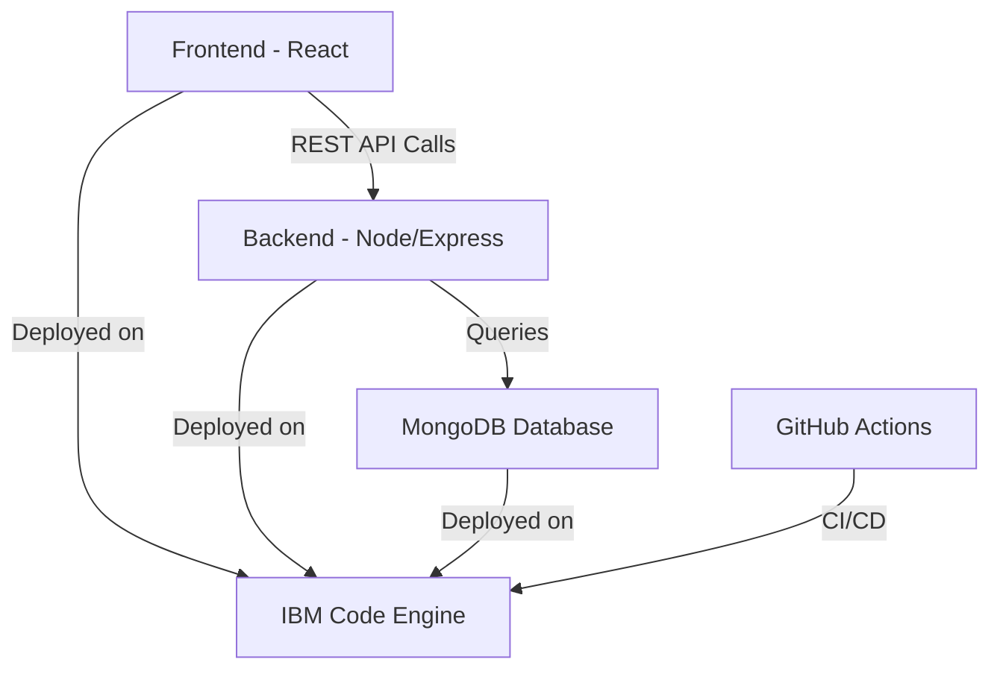

# 🌐 PluckD
**"Pluck it. Swap it. Love it."**

[](https://reactjs.org/)
[](https://nodejs.org/)
[](https://www.mongodb.com/)
[](https://www.ibm.com/cloud)
[](https://www.docker.com/)

PluckD is a **full-stack MERN application** deployed entirely on **IBM Cloud Code Engine**. It's a **community-driven platform** where users can list, discover, and claim second-hand treasures — giving unused items a second life.

🔗 **Live Deployment:**
- **Frontend:** [PluckD Website](https://pluckdwebsite.1zl7uf3hsx1e.us-south.codeengine.appdomain.cloud)
- **Backend API:** [PluckD Backend](https://pluckd-backend.1zl7uf3hsx1e.us-south.codeengine.appdomain.cloud)

---

## ✨ Features

### 👤 User Management
- **Secure Authentication** with JWT tokens
- **User Registration & Login** system
- **Profile Management** - edit personal details
- **Ownership Control** - manage only your own posts and comments

### 📦 Item Listings
- **Create Listings** with detailed descriptions and images
- **Browse & Filter** all available items
- **Search Functionality** by keywords or categories
- **Delete Control** - only creators can remove their posts

### 💬 Community Engagement
- **Interactive Comments** on all listings
- **Comment Management** - delete your own comments
- **Sentiment Analysis** integration for text analysis
- **Community-Driven** discovery and interaction

### ☁️ Cloud-Native Architecture
- **Fully Containerized** deployment on IBM Code Engine
- **Scalable Infrastructure** with managed MongoDB
- **CI/CD Pipeline** with GitHub Actions
- **Production-Ready** with automated testing and quality checks

---

## 🏗️ Architecture



---

## 🚀 Tech Stack

### Frontend
- **React** - Modern UI library
- **React Router** - Client-side routing
- **CSS** - Custom styling

### Backend
- **Node.js** - Runtime environment
- **Express.js** - Web framework
- **JWT** - Authentication
- **Natural** - NLP sentiment analysis

### Database
- **MongoDB** - NoSQL document database

### DevOps & Deployment
- **Docker** - Containerization
- **IBM Code Engine** - Serverless container platform
- **GitHub Actions** - CI/CD pipeline

### Additional Tools
- **CORS** - Cross-origin resource sharing
- **dotenv** - Environment variable management

---

## 🛠️ Getting Started

### Prerequisites
- Node.js (v14 or higher)
- npm or yarn
- MongoDB instance
- Git

### Installation

1. **Clone the repository**
```bash
git clone https://github.com/Muhammad124Ahmad/pluckd-app.git
cd pluckd-app
```

2. **Set up environment variables**

Create a `.env` file in the backend directory:
```env
MONGO_URI=your_mongo_connection_string
JWT_SECRET=your_secret_key
PORT=5000
```

3. **Install backend dependencies**
```bash
cd pluckd-backend
npm install
```

4. **Install frontend dependencies**
```bash
cd ../pluckd-frontend
npm install
```

5. **Start the development servers**

Backend (from pluckd-backend directory):
```bash
npm start
```

Frontend (from pluckd-frontend directory):
```bash
npm start
```

6. **Open your browser**
```
http://localhost:3000
```

---

## 📡 API Documentation

### 🔑 Authentication Endpoints

#### Register User
```http
POST /api/auth/register
Content-Type: application/json

{
  "username": "testuser",
  "email": "test@example.com", 
  "password": "password123"
}
```

#### Login User
```http
POST /api/auth/login
Content-Type: application/json

{
  "email": "test@example.com",
  "password": "password123"
}
```

**Response:**
```json
{
  "token": "your-jwt-token",
  "user": {
    "id": "user-id",
    "username": "testuser",
    "email": "test@example.com"
  }
}
```

### 📦 Posts/Gifts Endpoints

#### Get All Posts
```http
GET /api/gifts
```

#### Get Post by ID
```http
GET /api/gifts/:id
```

#### Create New Post
```http
POST /api/gifts
Authorization: Bearer <token>
Content-Type: application/json

{
  "title": "Old Laptop",
  "description": "Working condition, 8GB RAM",
  "imageUrl": "http://image-link.com/laptop.jpg"
}
```

#### Delete Post
```http
DELETE /api/gifts/:id
Authorization: Bearer <token>
```

### 💬 Comments Endpoints

#### Add Comment
```http
POST /api/comments/:giftId
Authorization: Bearer <token>
Content-Type: application/json

{
  "text": "This looks great, I'd love to pluck it!"
}
```

#### Delete Comment
```http
DELETE /api/comments/:commentId
Authorization: Bearer <token>
```

### 🔍 Search & Analysis

#### Search Items
```http
GET /api/search?keyword=laptop&category=electronics
```

#### Sentiment Analysis
```http
POST /api/sentiment
Content-Type: application/json

{
  "sentence": "I love this community platform!"
}
```

**Response:**
```json
{
  "score": "positive",
  "confidence": 0.8
}
```

---

## 🚢 Deployment

This project is deployed on **IBM Cloud Code Engine** with the following components:

- **Frontend Application**: React SPA served as a container
- **Backend API**: Node.js/Express application 
- **Database**: MongoDB deployed as a managed container
- **CI/CD**: GitHub Actions for automated testing and deployment

### Docker Configuration

The project includes Dockerfiles for both frontend and backend components, optimized for IBM Code Engine deployment.

---

## 🤝 Contributing

Contributions are welcome! Please feel free to submit a Pull Request.

### How to Contribute

1. **Fork the repository**
2. **Create a feature branch**
   ```bash
   git checkout -b feature/amazing-feature
   ```
3. **Make your changes**
4. **Commit your changes**
   ```bash
   git commit -m 'Add some amazing feature'
   ```
5. **Push to the branch**
   ```bash
   git push origin feature/amazing-feature
   ```
6. **Open a Pull Request**

### Code Standards
- Follow existing code style and conventions
- Write clear commit messages
- Add tests for new functionality
- Update documentation as needed

---

## 📋 Roadmap

- [ ] Real-time chat functionality
- [ ] Advanced filtering and sorting
- [ ] Image upload optimization
- [ ] Mobile app development
- [ ] Enhanced recommendation system
- [ ] Multi-language support

---

## 📄 License

This project is licensed under the MIT License - see the [LICENSE](LICENSE) file for details.

---

## 👨‍💻 Author

**Muhammad Ahmad Mubasher**

- 🌐 GitHub: [@Muhammad124Ahmad](https://github.com/Muhammad124Ahmad)
- 💼 LinkedIn: [Muhammad Ahmad](https://www.linkedin.com/in/muhammad510ahmad-dev)
- 📧 Email: muhammad510ahmad@gmail.com

---

## 🙏 Acknowledgments

- IBM Cloud Code Engine for hosting infrastructure
- MongoDB for database solutions
- React community for excellent documentation
- All contributors and users of PluckD

---

<div align="center">
  <strong>Made with 🧠 for sustainable living</strong>
</div>
